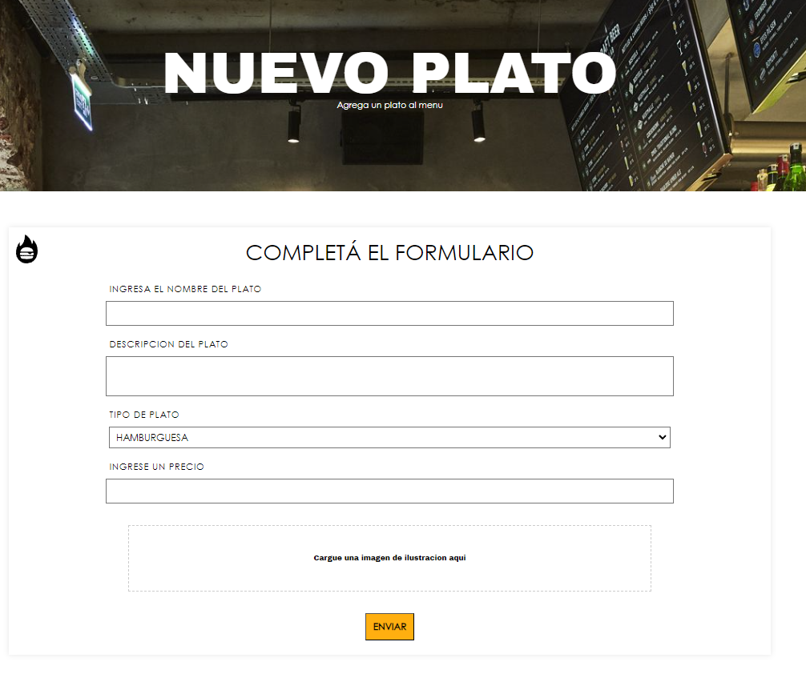

# PROYECTO PAW 2024

- El proyecto que se propone es la Web de una casa de comidas rápidas que tenga como principal función el de dar a conocer la marca, además de brindar la posibilidad de pedir comida tanto para el take away como para el pedido desde la mesa del local y /o la recepción del pedido por parte de los empleados de atención al público.

## [Site MAP del sitio](https://www.figma.com/file/inLYqyIMxmiy6WxPlx6cey/wireframe-grupo-paw?type=design&node-id=0-1&mode=design&t=FRZzKBVkGpIr7CmU-0)

## [WireFrame del Sitio](https://www.figma.com/file/inLYqyIMxmiy6WxPlx6cey/wireframe-grupo-paw?type=design&node-id=1-48&mode=design&t=FRZzKBVkGpIr7CmU-0)

## [PASOS PARA SU INSTALACION](Instalacion.md)

# Funcionalidades:

## PUESTA EN FUNCIONAMIENTO:
### Requisitos previos:
    - Debe existir la base de datos `mvc-paw-power`
    - Debe existir el archivo `.env` el cual contiene los datos de configuracion del sistema
    - Debe existir la carpeta `/uploads`
* Si aun no realizo alguno de estos pasos, le solicitamos ir a la seccion de [pasos para su instalacion](Instalacion.md), para proseguir con la puesta en marcha

### 1. Alta Plato:
- **Loguearse como Empleado**: 
    - Puede usar como prueba:
        - Usuario: `empleado1`
        - Contraseña: `password3`
- **Navegar hasta PERFIL EMPLEADO > NUEVO PLATO**        
    - Navegar hasta "PERFIL EMPLEADO"/Nuevo Plato o directamente en el navegador a la URL: `http://[dominio]:[puerto]/plato/new`
    - Para testeos en entornos locales puede usar como dominio: `localhost` y puerto `8080`
    #### Proceso de Alta:
        - 1) Llenar el formulario con los datos de la comida
        

### 2. Reserva Mesa:
- **Navegar hasta RESERVAR**
- **Loguearse como Cliente o Empleado**:
    - Puede usar como prueba:
        - Usuario: `empleado1`
        - Contraseña: `password3`
    - O:
        - Usuario: `cliente1`
        - Contraseña: `password1`
- **Navegar hasta RESERVAS** y realizar la reserva:
    - Se controla que el local, fecha y hora sean los correctos. Caso contrario, muestra los mensajes de error correspondientes, con tag `p` que están ocultos.
    - Se controla que haya sido seleccionada una mesa. Por el momento, solo se contempla la reserva de una mesa.
### 3. Turnero:
- **Vista Cliente**:
- Puede usar como prueba:
        - Usuario: `cliente1`
        - Contraseña: `password1`
- **Navegar hasta MENU**        
    - 1) Elegir los productos
    - 2) Llenar el formulario de pedido
    - 3) Enviar el formulario
        - 3.1) Controles: Se controla que el carrito tenga al menos un item, que el formulario de pedido este con los input completos.  
    - 4) Funcionalidad: 
        - Se puede ver el estado del pedido el cual cambia en tiempo real
        - Tiene la opcion para que el sistema de aviso, al momento de que el pedido cambia de estado. 
- **Vista Empleado**
    - Puede usar como prueba:
        - Usuario: `empleado1`
        - Contraseña: `password3`
- **Navegar hasta PERFIL EMPLEADO > PEDIDOS ENTRANTES**
    - Funcionalidad: En pedidos entrantes se puede cambiar el estado del pedido sin cambiar de vista. El mismo interactua con el servidor mediante peticiones ajax.    